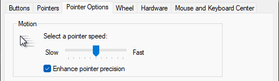
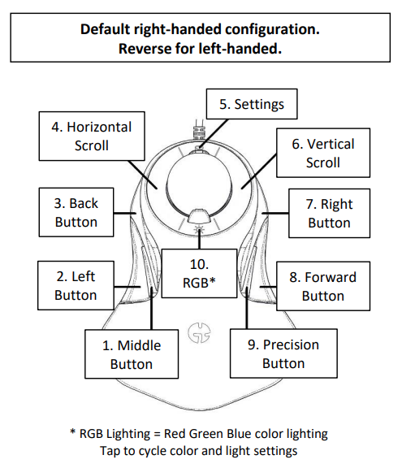
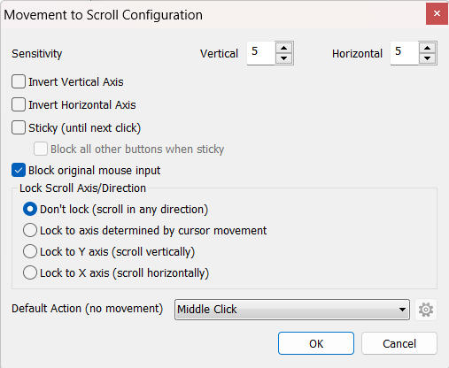

# gameball-settings

My personal gameball mouse settings with a focus on scrolling for programming.

I use Windows to set default mouse settings and X-Mouse to enhance my Gameball settings.

## Windows Defaults

I have the following default windows mouse settings:

- Pointer motion set to the middle as a default
- **Enhance pointer precision** is enabled

## Gameball Settings

1 - overridden by X-Mouse (See X-Mouse Settings below)
2 - default
3 - default
4 - default
5 - **Button configuration** - right and left, **Scrolling mode** - continuous (default)
6 - default
7 - default
8 - default
9 - **400** cpi
10 - **RGB** - 3rd blue color (light blue), **Polling Rate** - **1000Hz** (default)
1 & 9 - **Unwanted ball motion** - enabled (default)

## X-Mouse Settings

- The middle button is used to scroll by clicking and holding the button down while using the ball to move
- If the middle button is clicked with no movement, it will default to the normal middle button click behavior
- Horizontal and vertical scroll values are set to **3** and **5** respectively

## License

MIT
