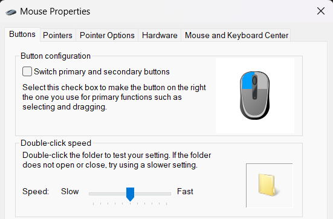

# Gameball Settings

My personal gameball mouse settings with a focus on scrolling.

I use Windows/macOS to set default mouse settings and X-Mouse/Hammerspoon to enable middle button click-and-hold autoscroll.

## GameBall Settings

- (1) overridden by x-mouse (See x-mouse settings below)
- (2) default
- (3) default
- (4) default
- (5) **Button configuration** - right and left, **Scrolling mode** - continuous (default)
- (6) default
- (7) default
- (8) default
- (9) **400** cpi
- (10) **RGB** - 3rd blue color (light blue), **Polling Rate** - **1000Hz** (default)
- (1) + (9) **Unwanted ball motion** - enabled (default)

## Windows

### System Defaults

- Pointer motion set to the middle as a default
- **Enhance pointer precision** is enabled
- All other settings are left as-is

### X-Mouse Settings

- Settings that enable middle button click-and-hold autoscroll
- Vertical and horizontal values are set to **5** as a default

## MacOS

### System Defaults

- Tracking speed set to the fastest to match default trackball movement speed
- All other settings are left as-is

### Hammerspoon Settings

[Autoscroll code](src/init.lua)

- Code that enables middle button click-and-hold autoscroll
- `reverseVerticalScrollDirection` set to `true` because macOS default scroll direction is opposite
- Copy and paste the code into the `init.lua` file and restart Hammerspoon

## License

MIT
